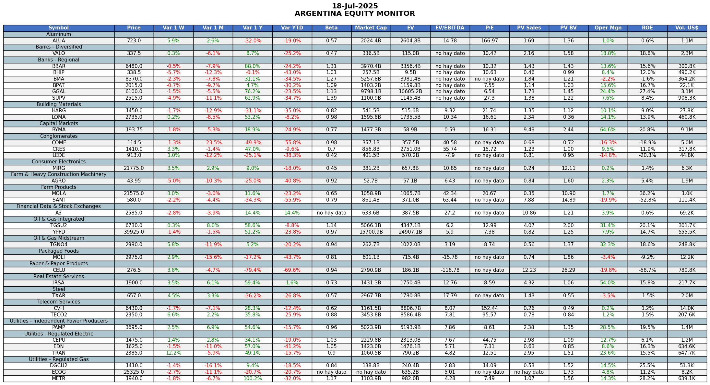

# Equity Monitor ARG

Este proyecto en Python permite monitorear semanalmente el estado de valuación de las principales acciones argentinas listadas en el exterior, utilizando datos financieros extraídos con `yfinance`.

## Objetivo

Automatizar un reporte de equity semanal para:

- Evaluar empresas argentinas mediante múltiplos clave (EV/EBITDA, P/E, P/B, etc.).
- Comparar valuaciones contra promedios históricos y sectoriales.
- Detectar oportunidades o anomalías en la valuación de mercado.
- Facilitar la publicación de informes en redes sociales (GitHub / LinkedIn).

## Herramientas Utilizadas

- Python 3.10+
- Yahoo Finance API (`yfinance`)
- Pandas / Numpy
- Matplotlib / Seaborn
- Plotly (opcional para gráficos interactivos)
- Google Colab

## Algunos Múltiplos Analizados

- EV/EBITDA
- Price to Earnings (P/E)
- Price to Book (P/B)
- Market Cap / Ventas
- Otros según disponibilidad del ticker

## Estructura del Proyecto

- `Equity_valuation_ARG.ipynb`: Notebook principal con el análisis de múltiples empresas.
- `/images`: Carpeta donde se guardan las visualizaciones exportadas.
- `README.md`: Este archivo de documentación.

## Próximas mejoras

- Automatizar modelos de valuación DCF.
- Dashboard interactivo con Streamlit.
- Scoring de acciones por múltiplos y momentum.
- Exportación semanal a PDF + Post en LinkedIn.

## Contribuciones

Este proyecto está en desarrollo. Si te interesa colaborar, proponer mejoras o integraciones, no dudes en abrir un `issue` o enviar un `pull request`.

## Contacto

Luca Camus, estudiante de economía y algunas cositas de finanzas.
 [LinkedIn](https://www.linkedin.com/in/luca-camus/)  
 luca.camus@fce.uncu.edu.ar
